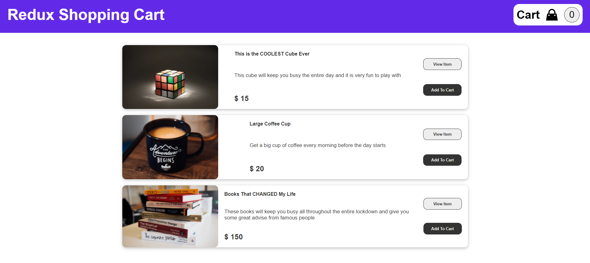
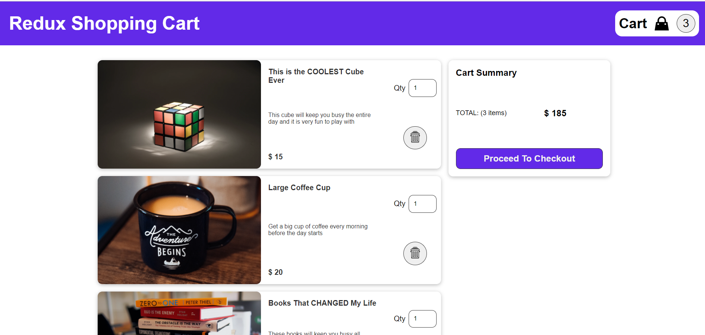
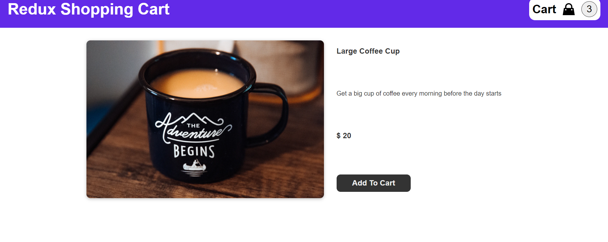

npx create-react-app shopping-cart --template typescript  
npm i react-router-dom@5.0.0  
npm i react-redux --save  
npm i redux --save  

 
# Difference between Redux and react-redux  
Redux is one particular library of JavaScript. Whereas react-redux is binding between two individual structures of JS i.e. redux and react.  
 
output:
 

 
 

 
 

 

